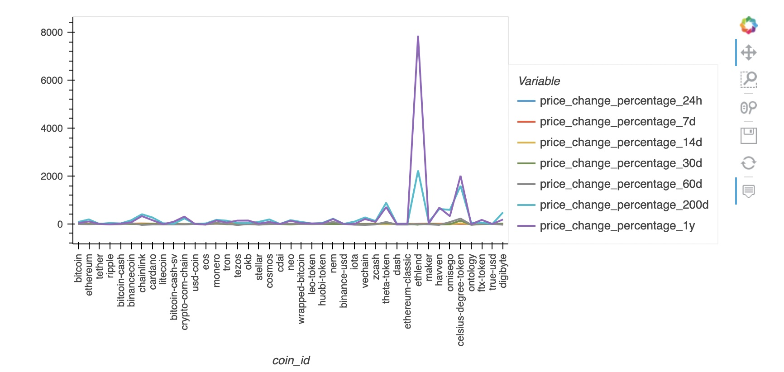
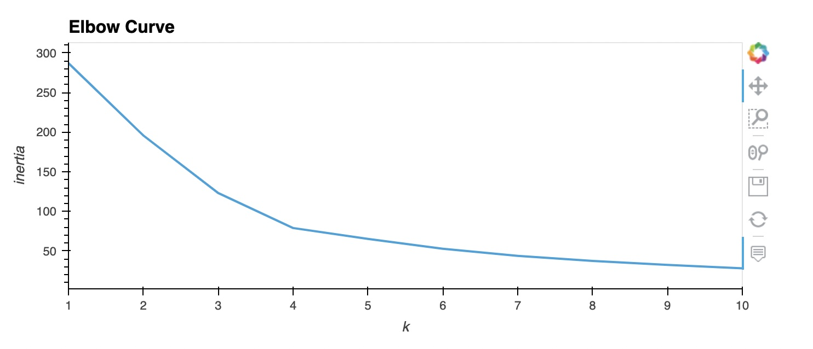
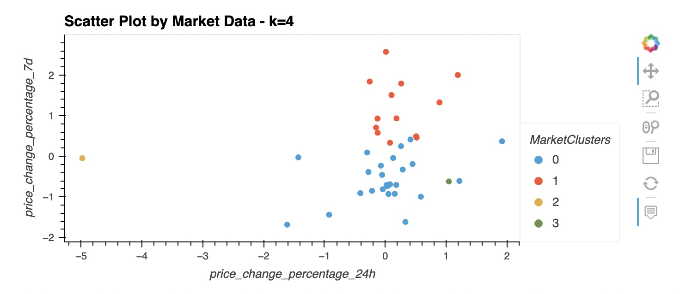

# crypto_investments
---
This Jupyter notebook clusters cryptocurrencies by their performance in different time periods. It plots the results to visually 
show the performance.

The data is provided in a CSV file in the Resources folder 

The chart below shows the construction of the data<br>

<br>
The data is calculated using the elbow algorithm in order to determine the optimal value for k<br>

<br>
The data is then calculated using the Kmeans algorithm in order to cluster the cryptocurrencies


<br><br>
The data is then charted with the PCA algorithm and analyzed side by side with the original data in order to determine the value of the different methods.

---
## Technologies

This notebook requires:


<br>This notebook requires Jupyter lab
<br>Installation:
```
pip install jupyterlab
````

This applications uses pandas<br>


```
pip install pandas
```
This application uses Pathlib<br>
```
pip install pathlib
```

<br>This application uses scikit learn
```
pip install scikit-learn
```


## Contributors

Brought to you by Rachel Bates

---

## License

Creative Commons